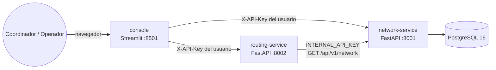
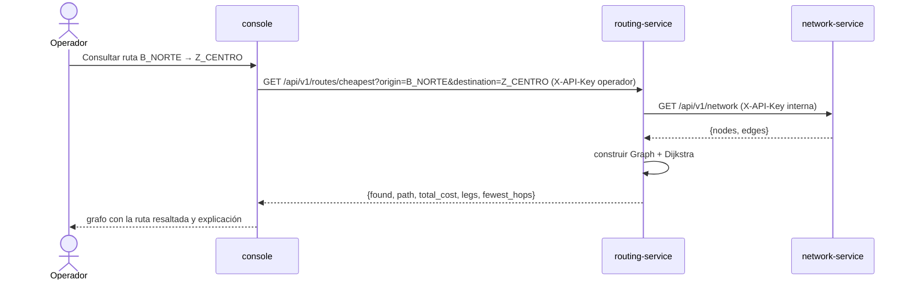

# 01 · Arquitectura

## Vista de contenedores



| Servicio | Responsabilidad (contexto) | Estado | Persistencia | Features |
|---|---|---|---|---|
| `network-service` | Dueño de la red: registra, valida y entrega la red | Con estado | PostgreSQL | F1 |
| `routing-service` | Calcula la cobertura y el menor costo sobre una copia de la red | Sin estado | Ninguna | F2, F3 |
| `console` | Interfaz del coordinador y del operador; solo habla HTTP | Sesión por usuario | Ninguna | F4 |
| `db` | Almacenamiento | — | Volumen `pgdata` | — |

Redes Docker:
- `backend` solo une `db` con `network-service`. La base de datos no es alcanzable desde los otros servicios.
- `frontend` une los servicios de aplicación.

Los puertos se publican solo en `127.0.0.1`.

## Por qué esta división

Ver [ADR 0002](adr/0002-microservicios-por-contexto.md). Se divide **por contexto de negocio**: configurar la red, calcular sobre la red y operar. No se divide por algoritmo.
BFS y Dijkstra comparten el mismo grafo en memoria. Separarlos en dos servicios duplicaría la carga de la red y la infraestructura sin aportar valor. En cambio, viven en **módulos separados** (`domain/coverage/` y `domain/cheapest_path/`), cada uno con su dueño.

## Flujo de una consulta



En el MVP, routing-service pide la red en cada consulta. Es simple, siempre está consistente y el volumen de datos es pequeño. Si hiciera falta, una caché con invalidación sería un ADR futuro.

## Capas por servicio (Clean/Hexagonal ligera)

```
src/<servicio>/
  domain/          entidades, reglas y algoritmos PUROS (sin I/O)  ← se prueba sin mocks
  application/     casos de uso + puertos (Protocol) que el dominio necesita
  infrastructure/  adaptadores: SQLAlchemy, cliente HTTP
  api/             routers FastAPI, esquemas Pydantic, traducción de errores
  core/            configuración transversal: errores, seguridad
  config.py        Settings (variables de entorno)
  main.py          create_app(): composición e inyección de dependencias
```

Regla de dependencias: `api → application → domain` e `infrastructure → application/domain`. El dominio no conoce a nadie.

## SOLID aplicado

| Principio | Dónde |
|---|---|
| **S**RP | Un caso de uso por clase. `core/errors.py` solo formatea errores y `core/security.py` solo autoriza. |
| **O**CP | Los algoritmos implementan `ReachabilityStrategy` y `PathFinder` (`routing_service/domain/strategies.py`). Una variante nueva (p. ej. A* para el cambio docente) se agrega sin modificar los casos de uso. |
| **L**SP | El repositorio en memoria (pruebas) y el de PostgreSQL son intercambiables detrás del mismo puerto. Lo mismo pasa con `NetworkGateway` (falso o HTTP). |
| **I**SP | Los puertos de lectura y de escritura de la red están separados: routing-service solo depende de leer. |
| **D**IP | Los casos de uso reciben puertos (`Protocol`). FastAPI `Depends` inyecta las implementaciones concretas en `main.py`. |

## Contratos y trabajo en paralelo

- El contrato HTTP está **congelado** en [03-api.md](03-api.md). Cambiarlo requiere un PR `contract-change`.
- El modelo de dominio compartido entre F2 y F3 (`Graph`, `TraceStep`, `ReachabilityResult`, `PathResult`) quedó fijado en la Fase 0, con pruebas.
- Los microservicios **no comparten librerías**. Cada uno replica su pequeño `core/` (errores y seguridad); esta duplicación es aceptada a cambio de despliegue y versionado independientes.
