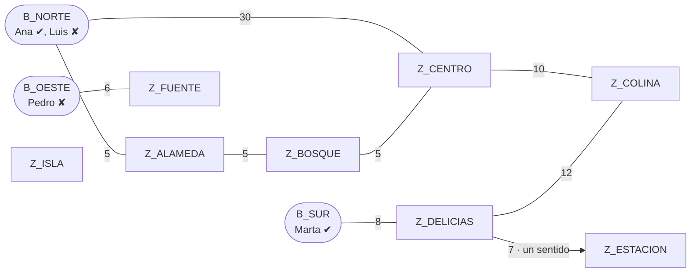

# 02 · Modelo de grafo

## Qué pregunta resuelve el grafo

> **¿Desde qué base se puede llegar a una zona, en cuántos tramos y con qué costo de traslado?**

El brief advierte que no se deben mezclar "técnico" y "zona" sin explicar esto. El grafo modela el **espacio de desplazamiento**. Los técnicos **no se desplazan por el grafo como puntos de paso**: son el recurso que sale de una base.

## Nodos

| Tipo | Representa | Atributos |
|---|---|---|
| `BASE` | Sede física desde la que salen técnicos | `id`, `name`, `technicians[]` (`id`, `name`, `available`) |
| `ZONE` | Barrio o sector que puede solicitar servicio | `id`, `name` |

- Formato del `id`: `^[A-Z0-9_-]{1,32}$` (p. ej. `B_NORTE`, `Z_CENTRO`). Es único entre **todos** los nodos.
- Las zonas no tienen técnicos. Enviar técnicos en una `ZONE` produce un error de validación.

## Aristas (conexiones / trayectos)

| Campo | Significado |
|---|---|
| `id` | Identificador único de la conexión (mismo formato que los nodos) |
| `source`, `target` | Nodos existentes, distintos entre sí (no hay lazos) |
| `weight` | **Tiempo estimado de traslado en minutos**, `0 < weight ≤ 1440` |
| `bidirectional` | `true` (por defecto) si el trayecto se recorre en ambos sentidos con el mismo tiempo |

### ¿Se puede recorrer una conexión en ambos sentidos?

Lo decide **la propia conexión**, con la bandera `bidirectional`:
- **Por defecto, sí.** La mayoría de los trayectos urbanos entre barrios se recorren en ambos sentidos con un tiempo similar.
- **Hay excepciones reales**: vías de un solo sentido, o un acceso que solo se usa para entrar a un sector. Para eso existe `bidirectional=false`.
- Si los tiempos de ida y de vuelta difieren, se registran **dos conexiones dirigidas** con pesos distintos.

**Representación interna:** el grafo es **dirigido**. Una conexión bidireccional se expande en dos arcos `u→v` y `v→u` con el mismo peso (`Graph.add_edge`). Así BFS y Dijkstra tratan un único caso, el dirigido, y el modelo admite ambos tipos de trayecto sin código especial.

### Duplicados

- Si un `id` de nodo, de conexión o de técnico ya existe, la respuesta es `409 DUPLICATE_ID`.
- La misma conexión física repetida también es un duplicado y da `409 DUPLICATE_EDGE`. Ocurre cuando ya existe un arco con el mismo par `(source, target)`. Si alguna de las dos conexiones es bidireccional, el par inverso también cuenta.

## Disponibilidad: ¿atributo o relación? (comparación pedida por el brief)

| Opción | Modelo | Implicaciones |
|---|---|---|
| **A. Atributo (elegida)** | `BASE.technicians[].available` | El grafo queda pequeño y estable. La cobertura depende solo de la red, y la disponibilidad **filtra** las bases candidatas en F3. Cambiar la disponibilidad no altera el grafo. |
| B. Relación | Nodo `TECNICO` con arista `TECNICO→BASE` (o `TECNICO→ZONA`) | Mezcla dos significados de arista: "trabaja en" y "se desplaza por". Además, los pesos de esas aristas no son tiempos de traslado, lo que obligaría a Dijkstra a distinguir tipos de arista. Cambiar la disponibilidad sería agregar o quitar aristas. |

Se elige **A** porque mantiene una sola semántica de arista (*tiempo de traslado*), que es la condición para que el costo total de Dijkstra tenga sentido. Ver [ADR 0003](adr/0003-modelo-de-grafo.md).

## Definiciones operativas

- **Cubrir (F2):** la zona Z está cubierta por la base B si **existe un camino dirigido** de B a Z. Es una pregunta de **alcance**, no de optimización. Se informa además el número mínimo de tramos (`hops`), que BFS entrega sin costo adicional.
- **Menor costo (F3):** es el camino de B a Z que minimiza la **suma de pesos** (minutos). No equivale a la menor cantidad de tramos (ver el contraejemplo en [05](05-algoritmos-dijkstra.md)).
- **Mejor alternativa de atención (F3):** entre las bases con **al menos un técnico disponible**, es la que tiene menor costo hasta la zona.

## Red de demostración (`seed/red_demo.json`)

Esta red incluye a propósito:
- **un contraejemplo de tramos y costo**: de `B_NORTE` a `Z_CENTRO`, el camino directo cuesta 30 min con 1 tramo, y el que pasa por `Z_ALAMEDA` y `Z_BOSQUE` cuesta 15 min con 3 tramos;
- **un trayecto de un solo sentido**: `Z_DELICIAS → Z_ESTACION`;
- **una componente desconectada** (`B_OESTE`–`Z_FUENTE`) y **una zona aislada** (`Z_ISLA`);
- **una base sin técnicos disponibles** (`B_OESTE`): `Z_FUENTE` es alcanzable, pero no atendible.
