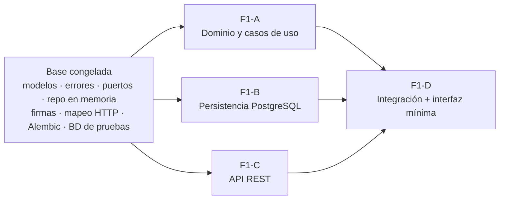

# F1 · Red de cobertura — construcción en 3 carriles paralelos

- **Servicio:** `network-service` · **Estado:** 🟡 Base lista; carriles A, B y C en construcción
- **Lea antes:** [02-modelo-de-grafo](../02-modelo-de-grafo.md), [03-api](../03-api.md#network-service-8001--feature-1), [06-seguridad](../06-seguridad.md), [07-testing](../07-testing-y-harness.md)

## Valor de negocio
El coordinador configura zonas y conexiones operativas asociadas a bases y técnicos. El operador consulta la red, sin modificarla.

## Alcance actual del proyecto
**Solo F1.** F2, F3 y F4 quedan para después ([09](../09-fases-y-roadmap.md)). F1 se construye en **3 carriles paralelos**, uno por persona o agente de IA, sobre una **base congelada** que ya está en `main`. Al final viene un paso de **integración** (F1-D).

| Carril | Qué construye | Especificación | Rama |
|---|---|---|---|
| **F1-A** | Reglas de validación y los 9 casos de uso | [F1A-dominio-casos-de-uso.md](F1A-dominio-casos-de-uso.md) | `feature/F1A-dominio-casos-de-uso` |
| **F1-B** | Tablas, migración Alembic y repositorio SQLAlchemy | [F1B-persistencia.md](F1B-persistencia.md) | `feature/F1B-persistencia` |
| **F1-C** | Esquemas Pydantic, endpoints e inyección de dependencias | [F1C-api-rest.md](F1C-api-rest.md) | `feature/F1C-api-rest` |
| **F1-D** | Prueba punta a punta, interfaz mínima en la consola y cierre | [F1D-integracion.md](F1D-integracion.md) | `feature/F1D-integracion` (después de A, B y C) |

Prompts listos para cada agente: [F1-prompts.md](F1-prompts.md).

## Por qué los carriles no se pisan

1. **Interfaces congeladas** con pruebas que las vigilan:
   - entidades: `domain/models.py`;
   - errores con su `code`: `domain/errors.py`;
   - puertos del repositorio: `application/ports.py`;
   - firmas de reglas y casos de uso: `tests/unit/test_frozen_interfaces.py`.
2. **Implementación de referencia** `InMemoryNetworkRepository`. A y C la usan en sus pruebas sin esperar a B.
3. **Suite de contrato** `tests/contract/repository_contract.py`: define exactamente qué debe hacer el repositorio de B.
4. **Mapeo de errores a HTTP** ya hecho (`api/error_mapping.py`) y **routers ya registrados** en `main.py`: C no toca `main.py`.
5. **Cada carril es dueño de archivos distintos** (tabla siguiente). Cada carril pasa `make test` por sí solo, sin depender de los otros, así que **se pueden fusionar en cualquier orden**.

## Propiedad de archivos (`services/network-service/`)

| Archivo / carpeta | Dueño | Regla |
|---|---|---|
| `src/network_service/domain/rules.py` | **F1-A** | Implementar los cuerpos; las firmas no cambian |
| `src/network_service/application/use_cases.py` | **F1-A** | Implementar los cuerpos; las clases y firmas no cambian |
| `tests/unit/domain/**`, `tests/unit/application/**` | **F1-A** | Crear |
| `src/network_service/infrastructure/orm.py` | **F1-B** | Agregar tablas |
| `src/network_service/infrastructure/database.py`, `sql_repository.py` | **F1-B** | Crear |
| `src/network_service/infrastructure/factory.py` | **F1-B** | Cambiar a PostgreSQL |
| `alembic/versions/**` | **F1-B** | Crear `0001_create_network_tables.py` |
| `tests/integration/test_sql_repository.py` | **F1-B** | Crear |
| `tests/unit/api/test_dependencies.py` | **F1-B** | Solo actualizar `test_base_factory_uses_memory_repository` |
| `src/network_service/api/schemas.py` | **F1-C** | Crear |
| `src/network_service/api/nodes.py`, `edges.py`, `network.py` | **F1-C** | Agregar endpoints |
| `src/network_service/api/dependencies.py` | **F1-C** | Agregar proveedores; `get_repository` no cambia |
| `tests/unit/api/test_nodes_api.py`, `test_edges_api.py`, `test_network_api.py` | **F1-C** | Crear |
| `domain/models.py`, `domain/errors.py`, `application/ports.py`, `infrastructure/memory_repository.py`, `api/error_mapping.py`, `core/**`, `config.py`, `main.py` | **Congelado** | Solo con PR `contract-change` aprobado por los 3 carriles |
| `tests/contract/**`, `tests/unit/test_frozen_interfaces.py`, `tests/conftest.py` | **Congelado** | Igual que la fila anterior |
| `Dockerfile`, `pyproject.toml`, `uv.lock`, `docker-compose*.yml`, `Makefile` | **Congelado** | Igual que la fila anterior. Ningún carril necesita dependencias nuevas |

Documentación: cada carril actualiza **su** archivo `docs/features/F1X-*.md` y **su fila** en la tabla de estado de [docs/README.md](../README.md). F1-C además marca ✅ los endpoints en [03-api.md](../03-api.md).

## Criterios de aceptación de F1 completa (los verifica F1-D)

- [ ] Se crean, listan, consultan y eliminan nodos y conexiones según el [contrato](../03-api.md).
- [ ] Identificadores con formato `^[A-Z0-9_-]{1,32}$`. Si no cumplen: `VALIDATION_ERROR`.
- [ ] Duplicados rechazados:
  - `DUPLICATE_ID` (nodo, conexión o técnico);
  - `DUPLICATE_EDGE` (mismo par o, si es bidireccional, el par inverso).
- [ ] Pesos `0 < weight ≤ 1440` (`INVALID_WEIGHT`), con `CHECK` también en la base de datos.
- [ ] `SELF_LOOP`, `NODE_NOT_FOUND`, `EDGE_NOT_FOUND` y `NODE_IN_USE` según el contrato.
- [ ] Solo las bases tienen técnicos.
- [ ] `GET /api/v1/network` devuelve la red ordenada para los roles coordinator, operator e internal.
- [ ] `POST /api/v1/network/import` es atómico y acepta `seed/red_demo.json`.
- [ ] Permisos: operator recibe 403 al escribir; sin clave, 401.
- [ ] Los datos persisten en PostgreSQL tras `make down && make up`. Las migraciones se aplican al arrancar.
- [ ] Interfaz mínima en la consola: ver la red y, como coordinador, registrar y cargar la red demo.
- [ ] La bidireccionalidad está justificada ([02](../02-modelo-de-grafo.md)).

## Evidencia
_F1-D adjunta aquí las capturas y salidas al cerrar la feature._
