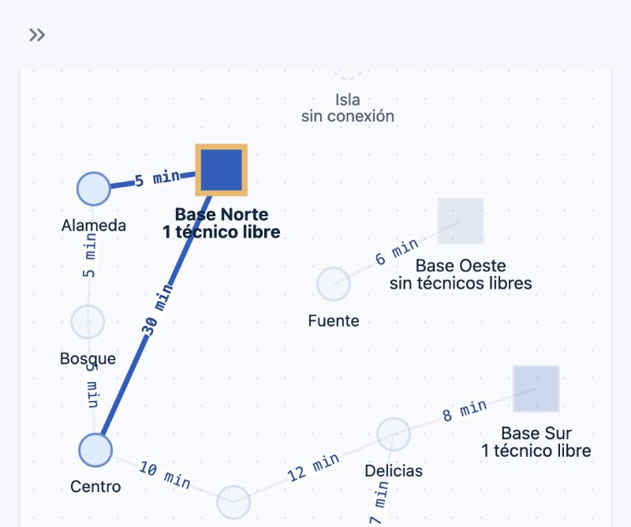
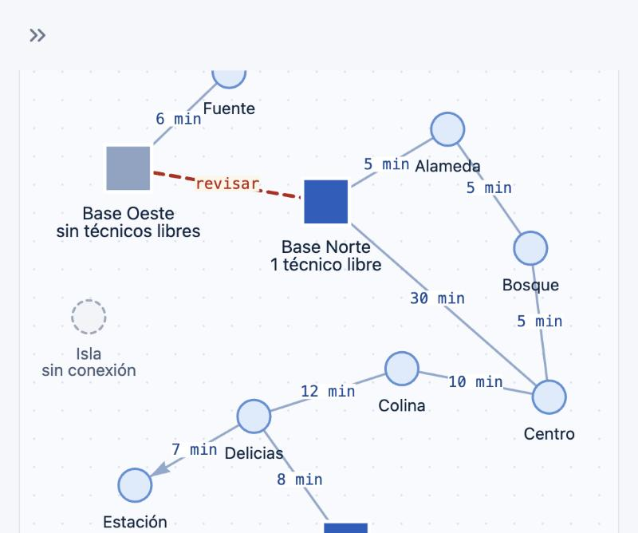

# F4 · Consola de operación demostrable

- **Servicio:** `console` · **Dueño:** Persona 4 · **Estado:** 🟡 Consola visual de la red lista (mapa interactivo, tema claro); cobertura y rutas pendientes (F2/F3)
- **Lea antes:** [ADR 0005](../adr/0005-consola-streamlit.md), [03-api](../03-api.md), [10-guia-prueba-manual](../10-guia-prueba-manual.md)

## Valor de negocio
El equipo de atención consulta la cobertura y la alternativa de servicio sin interpretar estructuras internas.

## Hecho en Fase 0
- [x] Inicio de sesión con API key: el rol se obtiene de `/auth/whoami` y la clave `internal` se rechaza.
- [x] Panel de estado de los servicios, con mensaje legible si un servicio está caído.
- [x] Clientes HTTP con traducción de errores del contrato (`ApiClientError`).

## Hecho en F1-D (interfaz mínima de la red)
- [x] Sección **Red** (ambos roles): tablas de nodos con técnicos y de conexiones con peso y sentido, botón "Actualizar".
- [x] Pestaña **Configurar red** (coordinador): registrar base o zona con técnicos, registrar conexión, eliminar nodo o conexión y cargar un JSON con `/network/import`.
- [x] Errores con el `message` del contrato (p. ej. `INVALID_WEIGHT`). Detalle: [F1-D](F1D-integracion.md).

## Hecho en la consola visual ([ADR 0006](../adr/0006-grafo-pyvis-embebido-seguro.md))
- [x] **Tema claro** (`.streamlit/config.toml`): fondo `#F4F7FB`, primario `#1F5FBF`, texto `#0F2540`.
- [x] **Mapa interactivo** de la red con pyvis (vis-network 9.1.2):
  - arrastrar nodos, zoom con rueda y botones, "Ajustar" y "Reorganizar" con animación;
  - hover con resumen; clic para resaltar los trayectos de un nodo y atenuar el resto.
- [x] **Red** (ambos roles):
  - indicadores (bases, zonas, trayectos, zonas sin conexión);
  - ficha del nodo: técnicos con su disponibilidad, trayectos y avisos (base sin técnicos libres, zona sin conexión);
  - tablas como respaldo accesible en "Ver como tabla".
- [x] **Configurar red** (coordinador): el mapa dibuja como **vista previa** la conexión que se está escribiendo (punteada en ámbar, o en rojo con "revisar" si el peso está fuera de rango) junto a la acción elegida.
- [x] Seguridad del embebido:
  - iframe con origen opaco (`data:`);
  - CSP sin red y con `script-src` por hash;
  - datos con `tojson`;
  - nombres escapados en Markdown;
  - pruebas en `tests/test_graph_view.py`.

## Sistema visual

Propuesta de diseño: lienzo "ServicioCerca · Consola visual" (artefacto privado del equipo).

| Rol | Color | Uso |
|---|---|---|
| Fondo / superficie | `#F4F7FB` / `#FFFFFF` | Lienzo y tarjetas |
| Tinta / secundario | `#0F2540` / `#4A5D78` | Texto (15,6:1 y 6,6:1 sobre blanco) |
| Azul primario | `#1F5FBF` | Bases con técnico libre, acciones, trayectos resaltados |
| Azul zona | `#DCEBFB` + borde `#5B8FD6` | Zonas |
| Azul trayecto | `#8FA9CC` | Aristas en reposo |
| Base sin técnicos libres | `#8CA3C3` | Mismo glifo, menos saturado |
| Ámbar / ámbar fuerte | `#F2B661` / `#E08A1E` | Selección; vista previa sin guardar |
| Rojo error | `#B42318` | Vista previa inválida |
| Gris inactivo | `#9AA8BA` (borde punteado) | Zona sin conexión |

**Teoría del color:**
- Los **azules análogos** dan calma y estructura.
- El **ámbar es complementario** del azul: solo marca lo que requiere atención.
- Los estados que hay que distinguir difieren también en **luminosidad**, no solo en tono, para que se distingan aunque se confundan los colores.

**Codificación sin leer:**
- forma = tipo (cuadrado base, círculo zona);
- borde punteado = sin conexión;
- longitud de la arista = minutos;
- flecha = solo ida.

## Criterios de aceptación (Fases 1 a 3)
- [x] **Coordinador:** formularios para registrar bases (con técnicos), zonas y conexiones; botón para cargar la red demo (`/network/import`); mensajes de validación legibles.
- [ ] **Operador:** consulta de cobertura (base y zona opcional), ruta de menor costo (origen y destino) y mejor atención (zona).
- [ ] **Visualización** (pyvis):
  - [x] bases y zonas diferenciadas;
  - [x] aristas con peso y dirección;
  - cobertura resaltada (nodos alcanzados y no alcanzados);
  - ruta resaltada, y el camino de menos tramos en un estilo distinto.
- [ ] Explicación en lenguaje natural del resultado (`message`) y traza opcional en un desplegable.
- [ ] Aceptación de: éxito, zona inexistente, red desconectada y peso inválido.
- [ ] Incorporar el **cambio de requisito docente** (Fase 4, por definir).
- [ ] Evidencia completa de la feature (capturas por escenario).

## Cambio de requisito docente
_Por definir. Registrar aquí el requisito, el ADR asociado y su impacto cuando se conozca._

## Evidencia (Fase 3)

Consola visual (2026-10-07):

| Red: Base Norte seleccionada (sus trayectos en azul, el resto atenuado) | Configurar red: vista previa con peso `-5` ("revisar") |
|---|---|
|  |  |

Pendiente: capturas de los escenarios de cobertura y ruta (F2/F3).
